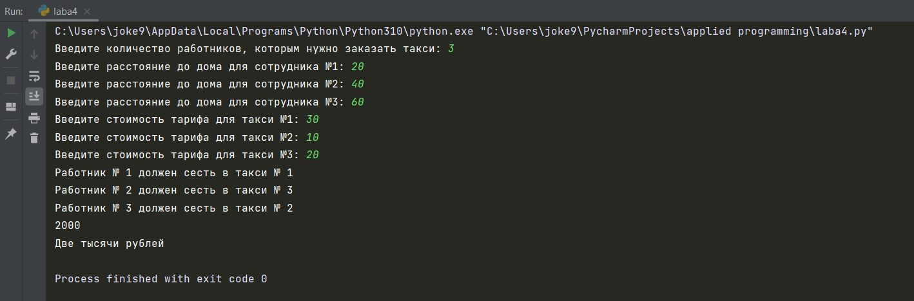
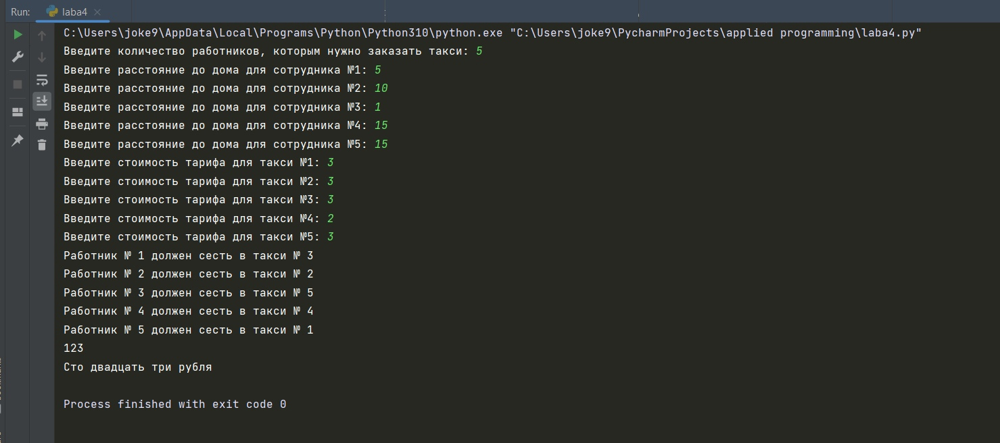

# Прикладная информатика / Лабораторная работа №4
## Описание
- Автор программы - Шляпникова Елена.
- Краткое описание - Реализованная программа задачи "Такси".
Была также позаимствована программа (convert.py) из Лабораторной работы №2 
для представления числа в текстовом формате (в рублях).
- Среда - Программа написана в PyCharm IDE, версия Python 3.10.
## Тестирование
### Входные данные
|                    | Тестовые данные №1 | Тестовые данные №2 | Тестовые данные №3 |
|-------------------:|:------------------:|:------------------:|:------------------:|
| Кол-во сотрудников |         3          |         5          |         1          |
|                 КМ |     20, 40, 60     |  5, 10, 1, 15, 15  |         -          |
|        Тариф такси |     30, 10, 20     |   3, 3, 3, 2, 3    |        130         |

### Тест 1

### Тест 2

### Тест 3

## Комментарий:

Для разработки данной программы использовалась среда разработки PyCharm.
Для открытия файла исходного кода можно использовать любую среду разработки.